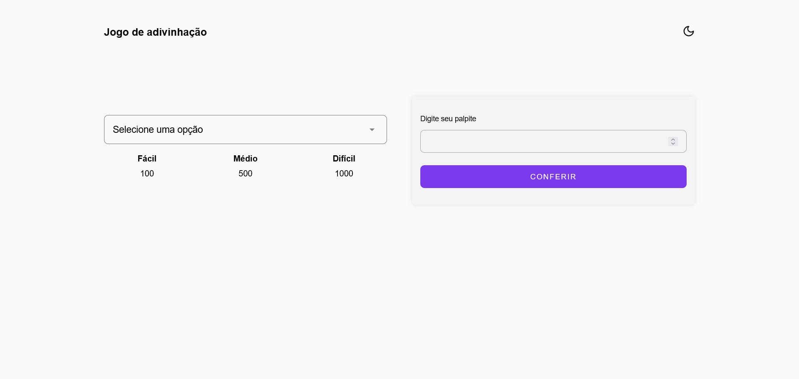
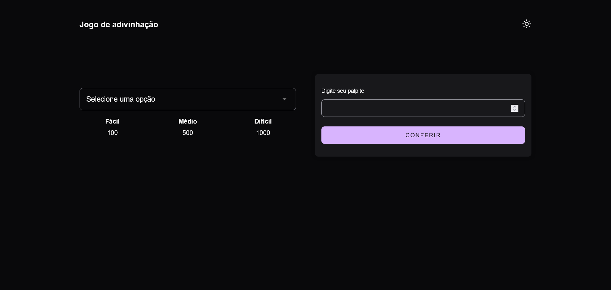

# 🎯 Jogo de Adivinhação em JavaScript
Projeto de jogo de adivinhação moderno e responsivo usando **HTML**, **CSS** e **JavaScript**. 

## 🔥 Introdução
Neste jogo, o computador gera um **número aleatório** entre 1 e 100 usando ``Math.random()``, e o jogador tem que tentar adivinhar.
A cada tentativa, o sistema dá dicas:

- "Muito alto!" ⬆️
- "Muito baixo!" ⬇️
- "Acertou!" 🎯

O jogo usa funções clássicas do **Math** como ``Math.random()``, ``Math.floor()``, ``Math.abs()`` e ``Math.round()``.


## ✨ Funcionalidades
- Ao carregar a página, um número secreto é gerado (1 a 100).
- O usuário digita um número e clica em "Chutar".
- O programa compara o palpite com o número secreto:
  - Se for maior, diz "Muito alto!".
  - Se for menor, diz "Muito baixo!".
  - Se acertar, mostra "Parabéns!" e permite reiniciar o jogo.
- Cada tentativa é contada! 🎯
- Limitar o número de tentativas (tipo "Você tem 10 chances").
- Gerar dicas tipo "Tá quente" 🔥 ou "Tá frio" ❄️ usando Math.abs().
- Mostrar histórico dos palpites do jogador.
- Fazer um modo difícil (número entre 1 e 1000).


## 📦 Tecnologias usadas
- HTML5
- CSS3 (estilização, transições e dark mode)
- JavaScript (manipulação de DOM)

## 🛠️ Conceitos Praticados
- ``Math.random()`` → Criar números aleatórios
- ``Math.floor()`` → Arredondar números pra baixo (pra pegar só o inteiro)
- ``Math.abs()`` → (opcional) Mostrar a distância absoluta do número
- Lógica condicional (``if/else``)
- Manipulação de DOM (``document.querySelector``, etc.)


## 📸 Preview


🔗 [Link da Demo](https://jogo-adivinhacao-devtatyane.vercel.app/)


## 📂 Estrutura do projeto

```
guessing_game/
├── src/
│   ├──  images/
│   │    ├── moon.svg
│   │    ├── preview-dark.png
│   │    ├── preview-light.png
│   │    └── sun.svg
│   ├── scripts/
│   │   └── index.js
│   └── styles/
│       └── style.css
├── index.html
└── README.md
```

## 🚀 Como rodar o projeto

1. Clone o repositório:
```bash
git clone https://github.com/tatyanepgoncalves/guessing_game
```

2. Acesse a pasta de projeto
```bash
cd guessing_game
```

3. Abra o arquivo `index.html` no navegador.
Ou use uma extensão tipo Live Server no VS Code para facilitar.

## 🧠 Melhorias futuras


## 🙋‍♀️ Autora
Feito com 💜 por Tatyane Gonçalves